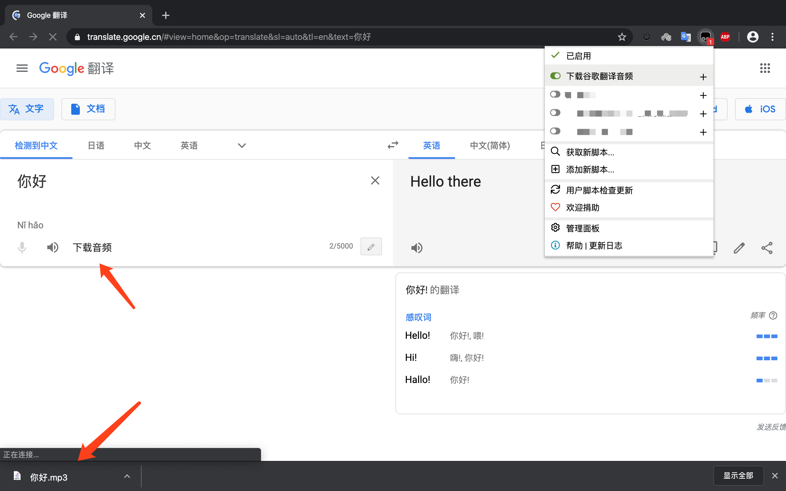

# 谷歌翻译音频下载脚本

因为自己有需求要下载谷歌翻译的音频，搜索之后看到大佬分享的[谷歌翻译 TKK值，tk值算法，api接口公布](https://www.52pojie.cn/thread-707169-1-1.html)，然后写了这个下载谷歌翻译音频的脚本。

目前下载的音频是**中文**，因为没找到自动检测语言怎么做到的，我默认写成了 `zh-CN`。

`url` 中有一个参数 `tl` 是判断音频语言的，如果有需求可以自己改成需要的语言。

如果大佬们有思路，还望分享，提前超级感谢。muuua

参考：[谷歌翻译 TKK值，tk值算法，api接口公布](https://www.52pojie.cn/thread-707169-1-1.html)、[油猴中文文档](https://my.oschina.net/u/2268567/blog/828528)

## 【2021-03-25更新】
- 目前谷歌翻译网页已更新，获取不到音频文件。此脚本失效，故在 [Greasy Fork](https://greasyfork.org/zh-CN/scripts/394133-下载谷歌翻译音频) 删除。
- 截止目前脚本下载量

## 功能
下载谷歌翻译中文音频文件。

## 效果图

## 脚本地址
[脚本安装地址](https://greasyfork.org/zh-CN/scripts/394133-%E4%B8%8B%E8%BD%BD%E8%B0%B7%E6%AD%8C%E7%BF%BB%E8%AF%91%E9%9F%B3%E9%A2%91)

## 问题反馈
如果有错误的话，请提 [issue](https://github.com/luneshao/GoogleTranslateAudioDownload/issues)，谢谢。 :D

## License
[MIT](https://github.com/Firefox-Pro-Coding/iciba-translate-userscript/blob/master/LICENSE)
